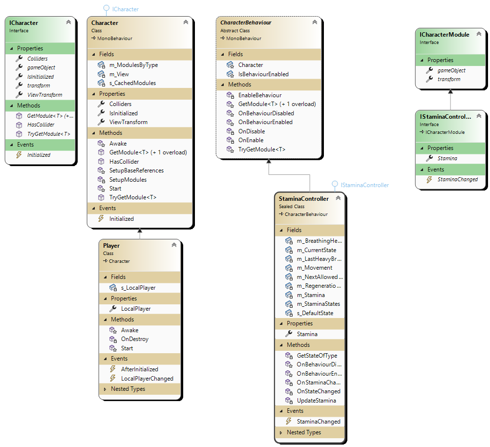

# Primitive Pursuit


[![Contributors][contributors-shield]][contributors-url]
[![Forks][forks-shield]][forks-url]
[![Stargazers][stars-shield]][stars-url]
[![Issues][issues-shield]][issues-url]
<!--[![MIT License][license-shield]][license-url]-->
<a href="https://www.linkedin.com/in/bengisu-sahin/" target="_blank">

</a>
<a href="https://www.linkedin.com/in/aybarsduran/" target="_blank">

</a>

  We are the Identical Studios two students and independent game developers who studying computer science and engineering at Akdeniz University.
  
  For the Senior Design Project course, we will develop a computer game. This game is going to be a survival game based on a story. 
 

<p>
Primitive Pursuit is an immersive survival game that pushes your endurance to its limits. In this game, you must navigate a challenging wilderness environment while managing your basic needs such as hunger, health, and sleep.
  
It is a unique survival experience crafted in the Unity game engine. As a player, you're thrown into a dynamic open-world environment where your survival skills are put to the ultimate test. The game offers a realistic experience by integrating various survival elements such as inventory management, health and hunger systems, building capabilities, and even the need for sleep.
  
This project demonstrates the use of various Unity modules, handlers, and behaviors to construct a complex and engaging game world.

Features
  
* Inventory System: Collect and manage items like weapons, ammunition, food, and more.
  
* Health Module: Keep track of your health status. Use items to heal and avoid damage to survive.
  
* Hunger System: Ensure you eat enough to maintain energy levels and stay alive.
  
* Sleep Mechanism: Sleep to restore your energy and keep sleep deprivation at bay.
  
* Building Capabilities: Gather resources and build structures to survive in the wilderness.
  
* Immersive Audio: An audio system that offers dynamic sound effects and background music.
  
* Realistic Environment: The game includes a day-night cycle and varied weather conditions, making survival even more challenging.
  
From strategizing resource management to making quick decisions in critical situations, Senior offers a comprehensive survival experience. Can you survive?
  
Mockups were designed on Canva website. You can find them in /Mockups directory. For more information please see the content below.  
    <br />
    <a href="https://github.com/aybarsduran/Senior/tree/main/Mockups"><strong>Explore the mockups »</strong></a>
    <br />
    <br />
    <a href="https://github.com/aybarsduran/Senior/tree/main/Documentation"><strong>Explore the documentations »</strong></a>
    <br />
    <br />
    <a href="">View Demo</a>
    ·
    <a href="https://github.com/aybarsduran/Senior/issues">Report Bug</a>
    ·
    <a href="https://github.com/aybarsduran/Senior/issues">Request Feature</a>
  </p>

<!-- TABLE OF CONTENTS -->
<details open="open">
  <summary><h2 style="display: inline-block">Table of Contents</h2></summary>
  <ol>
    <li>
      <a href="#about-the-project">About The Project</a>
      <ul>
        <li><a href="#built-with">Built With</a></li>
      </ul>
    </li>
    <li>
      <a href="#getting-started">Getting Started</a>
      <ul>
        <li><a href="#configuration-steps">Configuration Steps</a></li>
      </ul>
    </li>
    <li><a href="#how-to-play">How to play?</a></li>
    <li><a href="#demo">Demo</a></li>
    <li><a href="#future-expectation">Future Expectations</a></li>
    <li><a href="#class-diagram">Class Diagram</a></li>
    <li><a href="#contact">Contact</a></li>
  </ol>
</details>


<!-- ABOUT THE PROJECT -->
## About The Project
Primitive Pursuit takes you on an immersive journey into a harsh and unforgiving world. Crafted by Identical Studios, this gripping survival game pushes your limits as you navigate treacherous terrains and gather resources. Embrace your primal instincts and face the ultimate test of survival in this thrilling adventure.

### Built With

* [Unity 2021.3.18f1](https://unity.com/releases/editor/whats-new/2021.3.18)

<!-- GETTING STARTED -->
## Getting Started

### Why Unity?

Unity is declared the platform for implementation because it is a popular choice for game
development because it is cross-platform, easy to use, has a large asset library, and has a strong
community of developers. It also has a number of powerful features that make it a flexible
choice for creating a wide range of games and interactive content. 

Unity has a large and active community of developers and artists who share tips, advice, and resources with each other. This has been a great resource as we are new to Unity or looking for help with specific issues.

## Configuration Steps
1. Cloning the repository:

```
$ https://github.com/aybarsduran/Senior.git
```

2. Install [Unity Hub](https://docs.unity3d.com/2020.1/Documentation/Manual/GettingStartedInstallingHub.html) 
3. Install [Install Unity Editor 2021.3.18 Version](https://unity.com/releases/editor/whats-new/2021.3.18) 
4. Now run the app on your Unity editor with press the play button.

## How to Play?: 
 

Our game starts with a main menu. It shows a text box for the player’s name. User can write whatever it wants. After writing the name he/she can press the save button or cancel it by pressing the back button. If the user saves, the name will be shown in the right corner of the screen. 

In the main menu, left up corner of the screen, if the user presses the new game button, the game will be started. If the user presses the exit game button, the game will be closed. Also, there is a load game button for the continuation from the last saves. To use this there must be at least one save.

 

While playing, if the user presses the escape button it will open a pause menu.There are buttons starting with resume. The resume button will close the pause menu and continue playing. The save game button opens another UI for the saving part. The load game button opens another UI for the loading part. The quit to menu button will return to the main menu. The quit to the desktop button will close the game.

If the user presses the tab button it will open a inventory menu. In the inventory interface, there is a backpack in the middle. There are item containers in the backpack. It shows the items that the user picked up. Also, there is a bar that shows the maximum carry weight with the current weight of the backpack.

At the left, there is Crafting UI and it shows the crafting list that can be made by hand. Also, it shows the recipes for craft items. If the user has enough ingredients he/she can craft items. At the right, there is Character UI and it shows the clothes on the character. There are sections for the head, torso, legs, and feet clothes. The user can remove them by dragging or can wear them by dragging. 

 

While playing pressing the "B" button from the keyboard will open the building book. There are sections like fire, shelter, storage, workstation, and building. These sections have builds regarding their section. These builds need ingredients to build. If the user has enough ingredients, he/she can place them by clicking on them. Also, the book has an exit button to close the book.

 

Hit the tree to cut using the left click on the mouse.

 

Hold down the "E" button to eat grapes.

 

Press the "E" button to take a stone to your hands.

 

Press the right mouse button to aim, then press the left mouse button to throw the spear.

 

Press the "E" button to take a wood to your shoulders.

## Future Expectation

* Expansion of Current Modules:
We anticipate that the existing modules such as Inventory, Health, Hunger, Audio, Camera, Sleep, Movement, and Building will undergo further expansion to enrich gameplay. This could involve introducing additional item types in the Inventory module, more intricate health dynamics in the Health module, or more complex hunger systems in the Hunger module.

* Introduction of New Modules:
In order to enhance game complexity and depth, new modules could be introduced. Potential additions include a Climate/Weather module, which could alter player stats and game dynamics; a Quest/Storyline module, to offer specific goals and rewards to players; or an NPC Interaction module, which would enable dialogues or trade with non-player characters in the game world.

* Advanced AI:
We also foresee the development of more sophisticated AI-controlled characters. These could range from enemies with varying levels of intelligence and behaviour, to ally characters who can assist the player, or neutral characters that can interact with players in unexpected ways.

* Multiplayer Capabilities:
Should the game architecture and design permit, we expect to introduce multiplayer functionality. This could include cooperative play, player versus player dynamics, or a shared online world where players can interact and participate in a shared experience.

* Monetization Strategies:
If this project moves toward commercial distribution, strategies for monetization will become a significant aspect of development. This could involve introducing in-game purchases, developing subscription models, or incorporating ad integrations.

* Optimization and Rigorous Testing:
Continuous testing and optimization is a crucial part of future developments. This will involve regular play-testing, feedback collection, and debugging sessions to identify and rectify any performance bottlenecks or gameplay issues.

<!-- CLASS DIAGRAM -->
## Class Diagram


<!-- CONTACT -->
## Contact

Bengisu Şahin - bengisusaahin@gmail.com

Selim Aybars Duran - aybarsduran@outlook.com

Project Link: [https://github.com/aybarsduran/Senior](https://github.com/aybarsduran/Senior)

<!-- MARKDOWN LINKS & IMAGES -->
<!-- https://www.markdownguide.org/basic-syntax/#reference-style-links -->
[contributors-shield]: https://img.shields.io/github/contributors/aybarsduran/Senior.svg?style=for-the-badge
[contributors-url]: https://github.com/aybarsduran/Senior/graphs/contributors
[forks-shield]: https://img.shields.io/github/forks/aybarsduran/Senior.svg?style=for-the-badge
[forks-url]: https://github.com/aybarsduran/Senior/network/members
[stars-shield]: https://img.shields.io/github/stars/aybarsduran/Senior.svg?style=for-the-badge
[stars-url]: https://github.com/aybarsduran/Senior/stargazers
[issues-shield]: https://img.shields.io/github/issues/aybarsduran/Senior.svg?style=for-the-badge
[issues-url]: https://github.com/aybarsduran/Senior/issues
[license-shield]: https://img.shields.io/github/license/aybarsduran/Senior.svg?style=for-the-badge
[license-url]: https://github.com/aybarsduran/Senior/blob/master/LICENSE.txt
<!-- [linkedin-shield]: https://img.shields.io/badge/linkedin-%231E77B5.svg?&style=for-the-badge&logo=linkedin&logoColor=white alt=linkedin style="margin-bottom: 5px;"
[linkedin-url]: https://www.linkedin.com/in/bengisu-sahin/
[linkedinA-url]: https://www.linkedin.com/in/aybarsduran/--!>

<!--Reference: https://github.com/othneildrew/Best-README-Template -->
